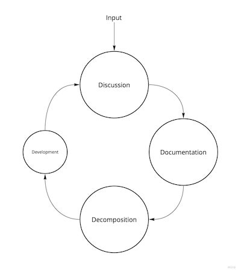

# Cycle of Change

## TL;DR

- **Discussion**
    - Problem
    - Solution
    - Complexity

## Definition

Cycle of making changes consists of four mandatory straight forward steps[^1]: discussion,
documentation, decomposition, development.

Each iteration of the cycle starts with the *input*, which is a description of the customer needs,
provided in arbitrary form.

> This document is created by the example, which has
> an [#155](https://github.com/toa-io/toa/issues/155) as the input.

[^1]: Neither step may be skipped when going forward. Going backward is arbitrary.

## Discussion

Discussion is a process of the input analysis to transform it into *correct*[^2], *consistent*[^3],
*complete*[^4] and *realizable*[^5] form, that is *strict* problem definition and find the solution
for that problem.

It is recommended for the discussion document to have sections:

<dl>
<dt>Abstract</dt>
<dd>
<i>Strict</i> abstract definition of <b>what</b> problem to be solved, and <b>how</b> it should be solved.
</dd>
<dt>Complexity</dt>
<dd>A number, which is abstract <a href="https://www.atlassian.com/agile/project-management/estimation">points estimation</a>.</dd>
<dt>Statements</dt>
<dd>List of <b>what is known</b>.</dd>
<dt>Questions</dt>
<dd>
List of <b>what is unknown</b>.

By the end of the discussion, all questions should be answered, and some answers should have become
statements.
</dd>
<dt>Options</dt>
<dd>List of considered options, starting with selected one, description of selection criteria.</dd>
</dl>

> While given sequence of sections ensures comfortable reading later, it will be most likely hard or
> impossible to be created in such order.

[^2]: Does not conflict with the input.
[^3]: Does not conflict with itself.
[^4]: Contains enough information for next steps of the cycle.
[^5]: Able to be implemented.

## Documentation

---

## Temporary Drafts

### Change Requests

List of changes to be made at the most top level available in the product.

Each item basically should be the message for the future commit or pull request, following the
existent commit message guidelines.

Example: `feat(cli): add option -e to toa export command`

### Structure of this document

- Documentation
    - Scenarios
        - Test
        - Steps
    - User manual, not development instruction
- Decomposition
    - Change Requests are future commits
- Development
    - Interface
    - Test
    - Code

- Granular Commits
    - What have you done?
    - Unfinished features 
